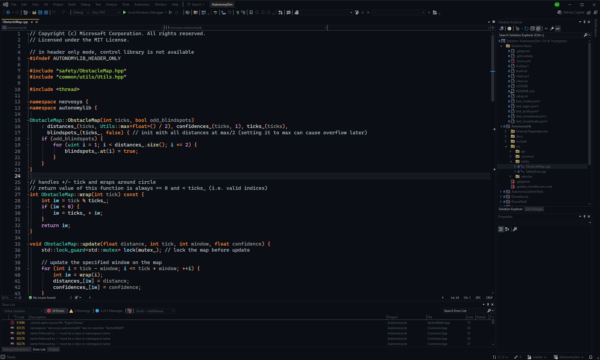

# Ayu Monokai color theme for Visual Studio

The Ayu Monokai color theme extension for Visual Studio (VS) based on the Visual Studio Code theme.



## Installation

```powershell
$vsixinstaller = "C:\Program Files\Microsoft Visual Studio\2022\Community\Common7\IDE\VSIXInstaller.exe"
$devenv = "C:\Program Files\Microsoft Visual Studio\2022\Community\Common7\IDE\devenv.exe"

& $vsixinstaller .\AyuMonokaiVS.vsix
& $devenv "/Command Tools.ImportandExportSettings /import:.\ayu-monokai-color-theme.vssettings"
```

## Build from Source

```powershell
$msbuild = "C:\Program Files\Microsoft Visual Studio\2022\Community\MSBuild\Current\Bin\MSBuild.exe"
$vsixinstaller = "C:\Program Files\Microsoft Visual Studio\2022\Community\Common7\IDE\VSIXInstaller.exe"
$devenv = "C:\Program Files\Microsoft Visual Studio\2022\Community\Common7\IDE\devenv.exe"

git clone "https://github.com/admercs/AyuMonokaiVS.git"
Set-Location AyuMonokaiVS
& $msbuild .\AyuMonokaiVS\AyuMonokaiVS.csproj -Target:Rebuild -Property:Configuration=Release
& $vsixinstaller .\AyuMonokaiVS\bin\Release\AyuMonokaiVS.vsix
& $devenv "/Command Tools.ImportandExportSettings /import:.\ayu-monokai-color-theme.vssettings"
```

## Convert VS Code theme to VS theme

Use the [Theme Converter for Visual Studio](https://github.com/microsoft/theme-converter-for-vs/):

```powershell
$msbuild = "C:\Program Files\Microsoft Visual Studio\2022\Community\MSBuild\Current\Bin\MSBuild.exe"

git clone "https://github.com/microsoft/theme-converter-for-vs.git"
cd "theme-converter-for-vs"
& $msbuild .\ThemeConverter\ThemeConverter.csproj -Target:Rebuild -Property:Configuration=Release
& ".\ThemeConverter\ThemeConverter\bin\Release\net6.0\ThemeConverter.exe" -i "\some\vscode_theme.json" -o "\some\directory"
```

Then, follow the rest of [the guide](https://github.com/microsoft/theme-converter-for-vs/) to convert the generated `pkgdef` file to `vsix`.

## License

MIT License
